# 👨‍💼 Employee Management System using SQL

## 📌 Project Overview
The **Employee Management System** is a SQL-based database project developed using MySQL.  
This project is designed to manage employee records, departments, attendance, salary details, and projects efficiently.

The project demonstrates important SQL concepts such as:
- ✅ Table Creation
- ✅ Data Insertion
- ✅ Joins
- ✅ Aggregate Functions
- ✅ Subqueries
- ✅ Views

---

# 🛠️ Tools & Technologies Used

| Tool | Purpose |
|------|---------|
| 💾 MySQL | Database Management |
| 🖥️ MySQL Workbench | SQL Development |
| 🌐 GitHub | Project Hosting |

---

# 📂 Database Tables

The project contains the following tables:

| Table Name | Description |
|------------|-------------|
| 🏢 departments | Stores department details |
| 👨‍💼 employees | Stores employee information |
| 📅 attendance | Stores employee attendance |
| 📁 projects | Stores project details |

---

# 📊 SQL Concepts Used

- 🔹 CREATE DATABASE
- 🔹 CREATE TABLE
- 🔹 INSERT INTO
- 🔹 SELECT Queries
- 🔹 WHERE Clause
- 🔹 ORDER BY
- 🔹 GROUP BY
- 🔹 INNER JOIN
- 🔹 LEFT JOIN
- 🔹 Aggregate Functions
- 🔹 Subqueries
- 🔹 VIEW

---

# ✨ Features

✅ Employee Data Management  
✅ Department-wise Analysis  
✅ Attendance Tracking  
✅ Salary Analysis  
✅ Employee Project Allocation  
✅ SQL Query Practice  
✅ View Creation  

---

# 📸 Project Screenshots

## 1️⃣ Display All Employees
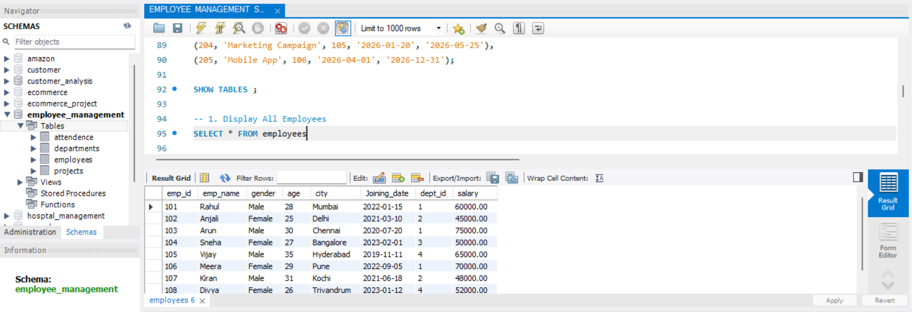

---

## 2️⃣ Employees Working in IT Department
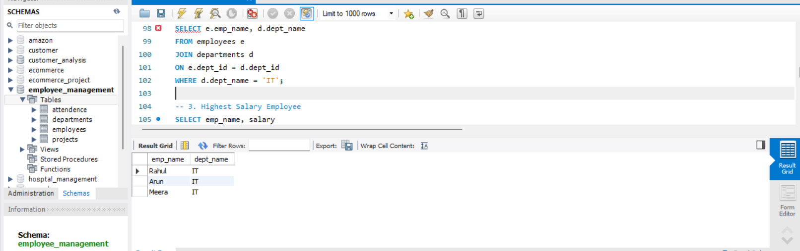

---

## 3️⃣ Highest Salary Employee
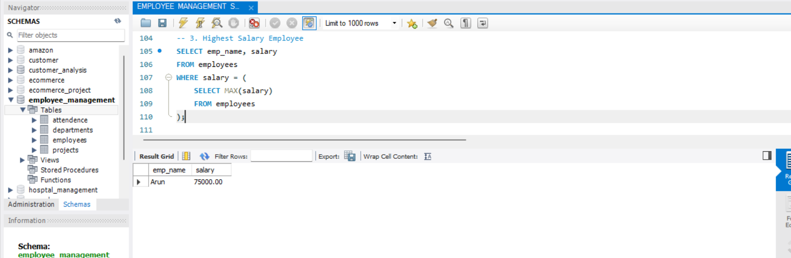

---

## 4️⃣ Department Wise Employee Count
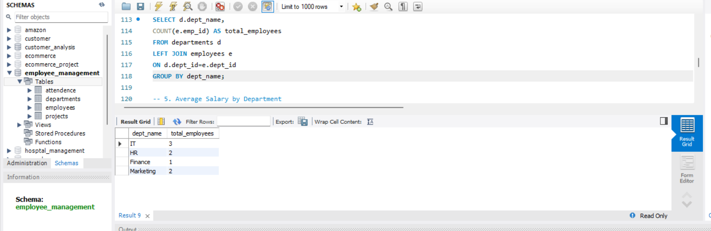

---

## 5️⃣ Average Salary by Department


---

## 6️⃣ Employees with Salary Greater Than 60000
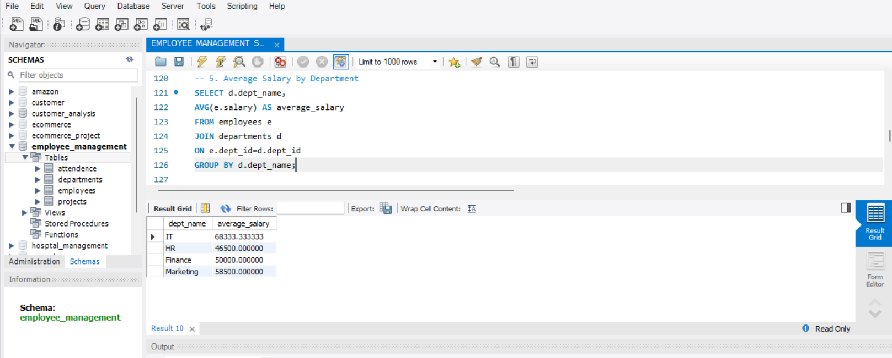

---

## 7️⃣ Employees Joined After 2021
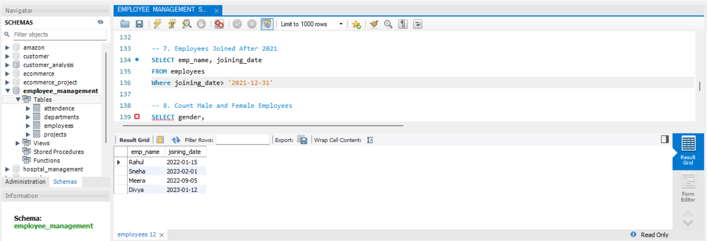

---

## 8️⃣ Count Male and Female Employees
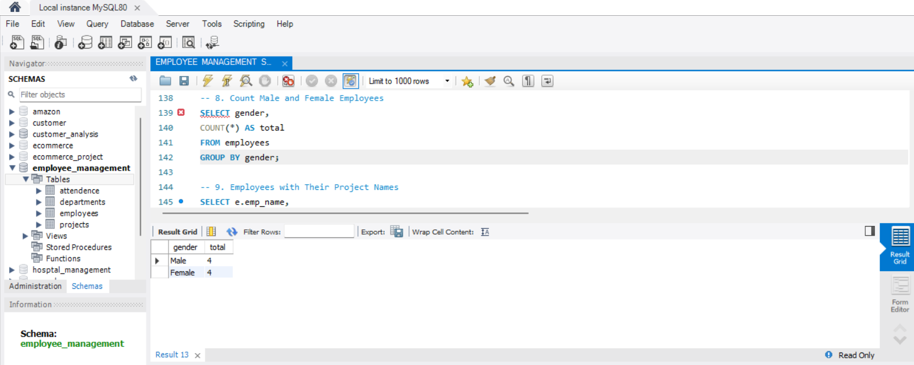

---

## 9️⃣ Employees with Their Project Names
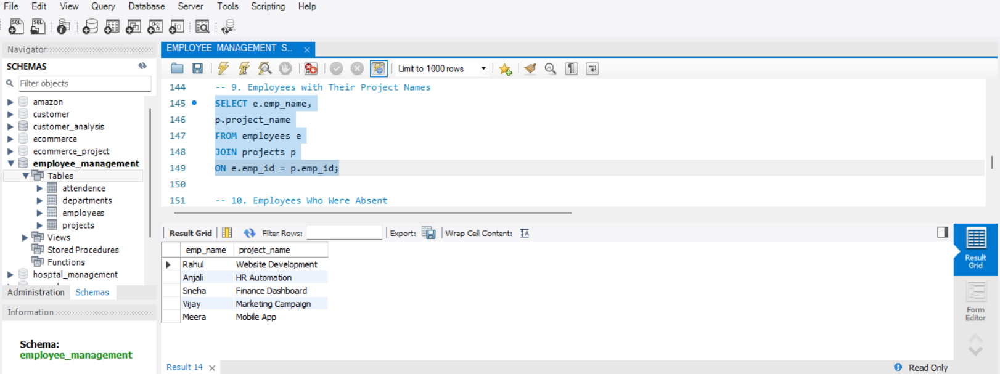

---

## 🔟 Employees Who Were Absent
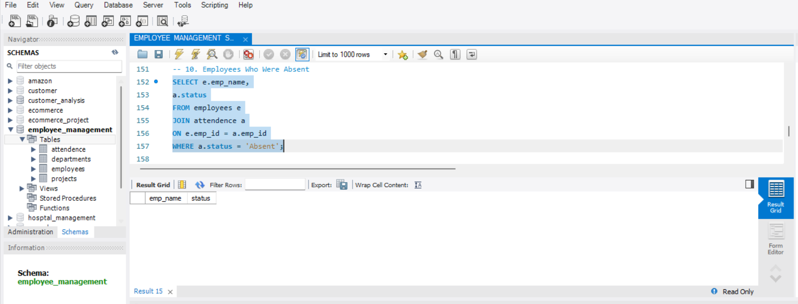

---

## 1️⃣1️⃣ Total Salary Expense
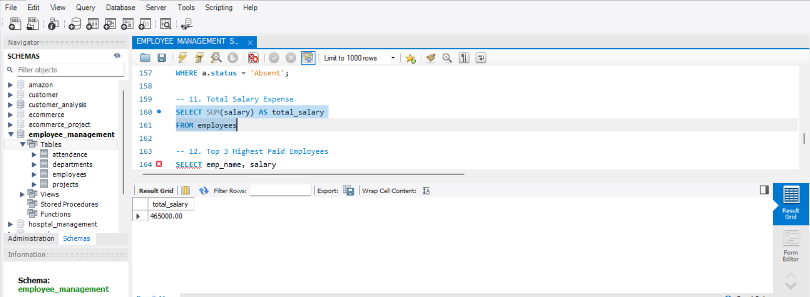

---

## 1️⃣2️⃣ Top 3 Highest Paid Employees
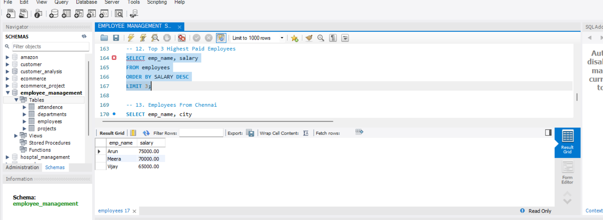

---

## 1️⃣3️⃣ Employees From Chennai
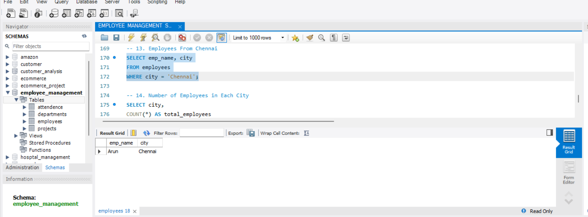

---

## 1️⃣4️⃣ Number of Employees in Each City
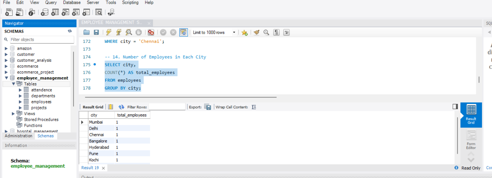

---

## 1️⃣5️⃣ View Output


---

# 📁 Project Structure

```text
employee-management-system-sql/
│
├── EMPLOYEE MANAGEMENT SYSTEM PROJECT.sql
├── README.md
└── screenshots/
```

---

# 🚀 How to Run the Project

1️⃣ Open MySQL Workbench  
2️⃣ Create a new SQL file  
3️⃣ Copy and paste the project SQL code  
4️⃣ Execute the queries  
5️⃣ View outputs and screenshots  

---

# 📚 Learning Outcomes

Through this project, I learned:
- SQL Database Design
- Table Relationships
- SQL Query Writing
- Joins and Aggregate Functions
- Subqueries and Views
- GitHub Project Management

---

# 👩‍💻 Author

**Jinitha**

🌟 Thank you for visiting this project!
